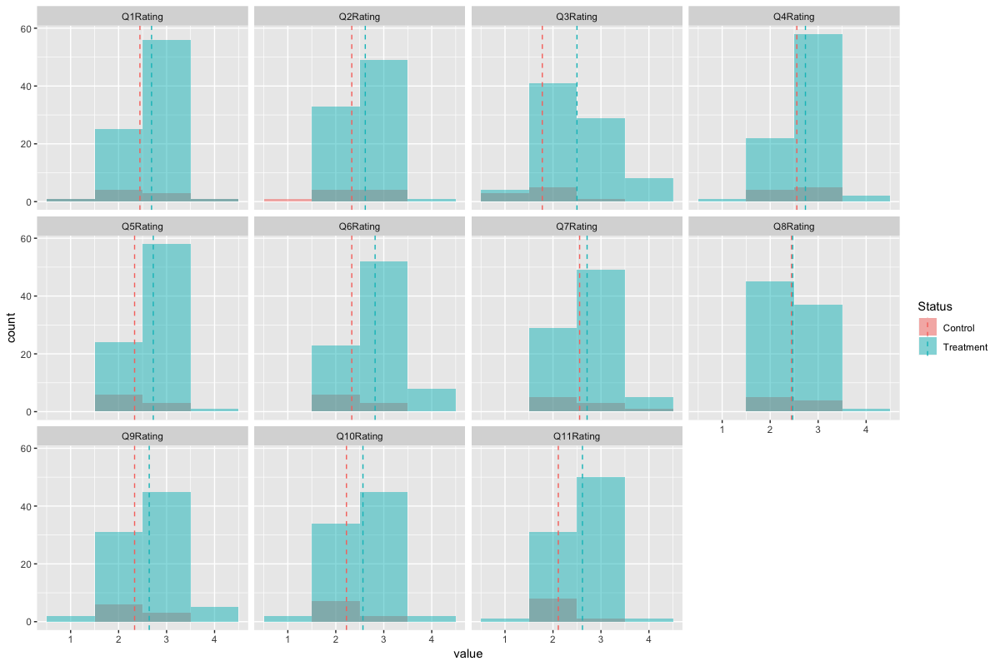
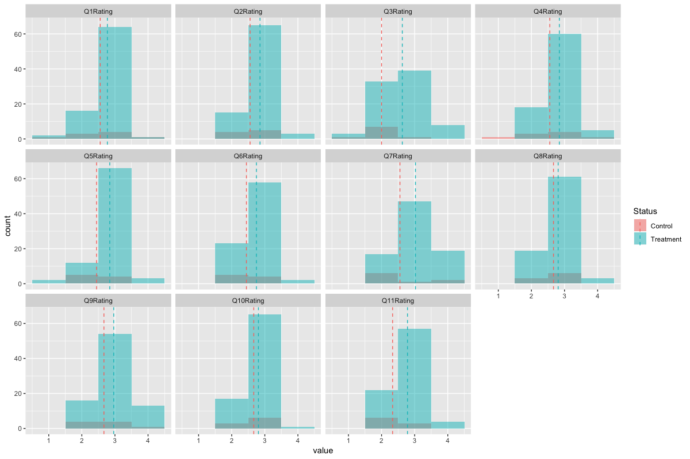

# Data for A Cause - Pencils of Promise

Goal: Visualising effectiveness of instruction in Ghana [data pre-processing work are not documented here yet]

**_1. Effectiveness of Teacher Support programming by analyzing changes within individual teachers' scores over time_**

The score differences (ranging from decrease of -2 to increase of 2 points) of each question (recorded from Round 1 and Round 2) for each teacher are plotted above. Most of the teacher's scoring for the different questions remained unchanged over time while some of the teacher's score increase or decrease over time. The table below details the score changes for each question over time.

| Qns | Num. of -2pts Decrease | Num. of -1pt Decrease | Num. of no diff | Num. of 1pt Increase | Num. of 2pts Increase |
|-----|------------------------|-----------------------|-----------------|----------------------|-----------------------|
| 1   | 1                      | 17                    | 57              | 15                   | 2                     |
| 2   | NA                     | 17                    | 55              | 19                   | 1                     |
| 3   | 5                      | 23                    | 43              | 13                   | 7                     |
| 4   | 2                      | 12                    | 62              | 15                   | 1                     |
| 5   | 1                      | 15                    | 56              | 18                   | 2                     |
| 6   | 1                      | 21                    | 54              | 16                   | NA                    |
| 7   | 2                      | 20                    | 45              | 20                   | 5                     |
| 8   | 1                      | 18                    | 44              | 28                   | 1                     |
| 9   | 2                      | 20                    | 42              | 24                   | 4                     |
| 10  | 1                      | 20                    | 47              | 22                   | 2                     |
| 11  | NA                     | 13                    | 49              | 29                   | 1                     |

From the above table and previous plot, we are not sure if there are any improvement of the teacher's scoring over time. Therefore, the mean score of each question is plotted to visualise if there are any improvement over time. 

The histogram plot above shows that other than 'Question 6', which dips slightly, the average scores (dotted line) for all the other questions increases over time signaling some form of success of the Teachers Support progamming.

**_2. Analyzing average changes and average scores between Treatment vs Control group_**

| Control | Treatment |
|---------|-----------|
| 18      | 166       |

It appears that there are much more teachers in the 'Treatment' group as compared to teachers in the 'Control' group (approx. 10%)

_2.1: Control vs Treatment for observation round 1_

The histogram plot below shows the average scores for teachers in observation round 1. The 'Treatment' group performs pretty much better than the 'Control' group except for 'Question 8' where there are no significant difference (average difference of only 0.025, shown in the Table below) between the 'Treatment' and 'Control' group. 

| qnsRating | round1ControlMean  | round1TreatmentMean | round1MeanDiff       |
|-----------|--------------------|---------------------|----------------------|
| Q1Rating  | 2.4444444444444446 | 2.6867469879518073  | 0.2423025435073627   |
| Q2Rating  | 2.3333333333333335 | 2.6144578313253013  | 0.2811244979919678   |
| Q3Rating  | 1.7777777777777777 | 2.5                 | 0.7222222222222223   |
| Q4Rating  | 2.5555555555555554 | 2.7349397590361444  | 0.17938420348058903  |
| Q5Rating  | 2.3333333333333335 | 2.7228915662650603  | 0.38955823293172687  |
| Q6Rating  | 2.3333333333333335 | 2.819277108433735   | 0.48594377510040143  |
| Q7Rating  | 2.5555555555555554 | 2.710843373493976   | 0.1552878179384205   |
| Q8Rating  | 2.4444444444444446 | 2.4698795180722892  | 0.025435073627844584 |
| Q9Rating  | 2.3333333333333335 | 2.63855421686747    | 0.30522088353413634  |
| Q10Rating | 2.2222222222222223 | 2.566265060240964   | 0.34404283801874147  |
| Q11Rating | 2.111111111111111  | 2.6144578313253013  | 0.5033467202141901   |

_2.2: Control vs Treatment for observation round 2_

