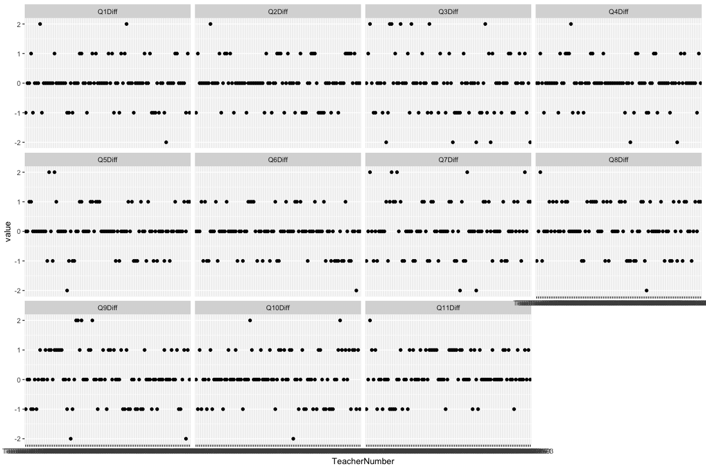
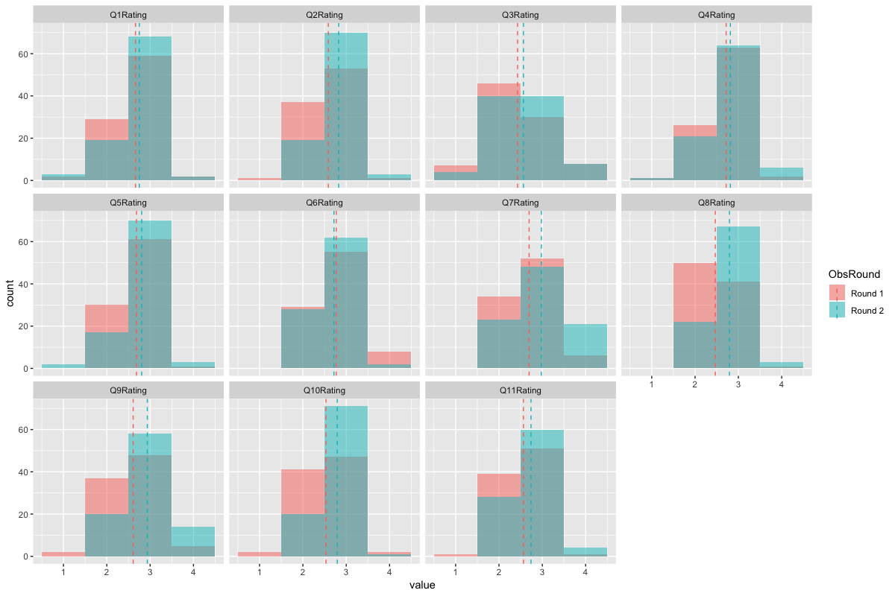

# Data for A Cause - Pencils of Promise

Goal: Visualising effectiveness of instruction in Ghana

<b>1. Effectiveness of Teacher Support programming by analyzing changes within individual teachers' scores over time</b>

The score differences (ranging from decrease of -2 to increase of 2 points) of each question (recorded from Round 1 and Round 2) for each teacher are plotted above. Most of the teacher's scoring for the different questions remained unchanged over time while some of the teacher's score increase or decrease over time. The table below details the score changes for each question over time.

| Qns | Num. of -2pts Decrease | Num. of -1pt Decrease | Num. of no diff | Num. of 1pt Increase | Num. of 2pts Increase |
|-----|------------------------|-----------------------|-----------------|----------------------|-----------------------|
| 1   | 1                      | 17                    | 57              | 15                   | 2                     |
| 2   | NA                     | 17                    | 55              | 19                   | 1                     |
| 3   | 5                      | 23                    | 43              | 13                   | 7                     |
| 4   | 2                      | 12                    | 62              | 15                   | 1                     |
| 5   | 1                      | 15                    | 56              | 18                   | 2                     |
| 6   | 1                      | 21                    | 54              | 16                   | NA                    |
| 7   | 2                      | 20                    | 45              | 20                   | 5                     |
| 8   | 1                      | 18                    | 44              | 28                   | 1                     |
| 9   | 2                      | 20                    | 42              | 24                   | 4                     |
| 10  | 1                      | 20                    | 47              | 22                   | 2                     |
| 11  | NA                     | 13                    | 49              | 29                   | 1                     |

From the above table and previous plot, we are not sure if there are any improvement of the teacher's scoring over time. Therefore, the mean score of each question is plotted to visualise if there are any improvement over time. 

